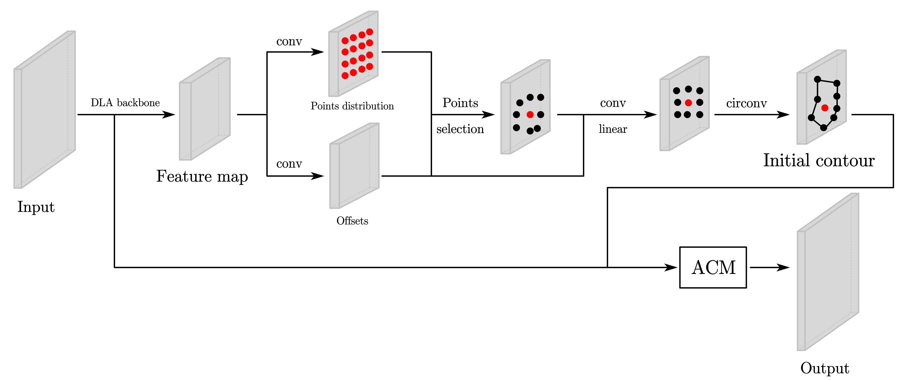
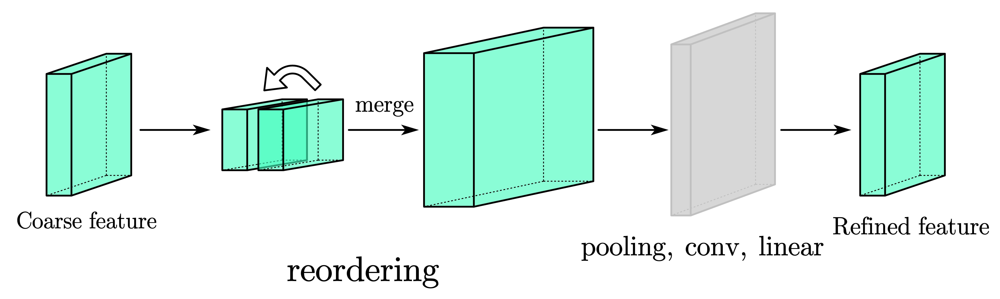
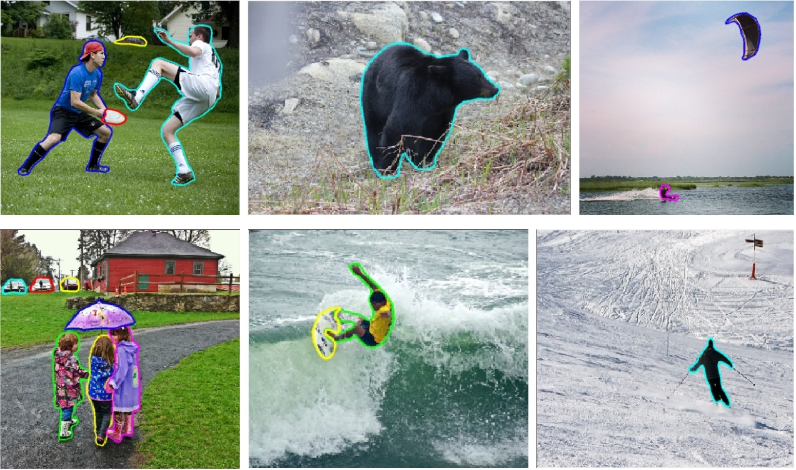

# CenterAC: Deep Center Point Regression Assisted by Active Contour for Instance Segmentation





> [**CenterAC: Deep Center Point Regression Assisted by Active Contour for Instance Segmentation**](https://ieeexplore.ieee.org/abstract/document/10662601)  
> Fuzheng Zhang, Guirong Weng, Yiyang Chen, Guina Wang  
> 43rd Chinese Control Conference (CCC), maybe CVPR in the future?

## Environment Configuration

Open "Anaconda prompt"
```
conda create -n centerac python=3.8
conda activate centerac

# install pytorch according to the cuda version
# here cuda version is 12.6, pytorch version is 1.12.1

pip install torch==1.7.1+cu110 torchvision==0.8.2+cu110 torchaudio==0.7.2
pip install Cython==0.28.2
pip install -r requirements.txt
```
---
For possible installation problems, select from the following solutions:

- The installation of DCN-V2 maybe difficult, you can choose another implementation method.
- `cfg.model.use_dcn` can be set `false`, which may lead to a slight drop in accuracy.
- You can install mmcv, and replace 352 line of `network/backbone/dla.py` as `from mmcv.ops import ModulatedDeformConv2dPack as DCN`, replace the `deformable_groups` in 353 line as `deform_groups`.

## Datasets Configuration

1. Download the COCO dataset at [here](https://cocodataset.org/#download).
2. Create the following folder structure in the same path:
   ```
   ├── /path/to/coco
   │   ├── annotations
   │   │   ├── instances_train2017.json
   │   │   ├── instances_val2017.json
   │   │   ├── image_info_test-dev2017.json
   │   ├── train2017
   │   ├── val2017
   │   ├── test2017
   ```
   ***The configuration for other datasets is similar.**

## Performances

The proposed model is tested on a single RTX 4090 with the COCO dataset.

|  Method   |   Backbone   | FPS |  AP  | AP_50 | AP_75 |
|:---------:|:------------:|:---:|:----:|-------|-------|
| Mask RCNN |  ResNet101   | 3.5 | 32.3 | 50.2  | 39.3  |
| BlendMask |  ResNet101   | 4.1 | 34.5 | 55.6  | 42.6  |
| PolarMask |  ResNet101   | 6.7 | 32.1 | 56.4  | 37.7  |
| DeepSnake |    DLA-34    | 5.8 | 31.8 | 58.2  | 45.3  |
|   E2EC    |    DLA-34    | 6.8 | 33.5 | 59.3  | 41.9  |
|    SAM    | ViT Encoder  | 3.6 | 39.8 | 60.1  | 45.8  |
| CenterAC  | GELAN + Conv | 7.1 | 40.1 | 59.9  | 42.3  |

## Testing

1. Download the pretrained model [here](http://gpcv.whu.edu.cn/member/ZhangTao/model.zip).

2. Prepare the COCO dataset according to "Datasets Configuration".

3. Test:
   
   Open visualize.py, modify the parameters in `parser` to meet different needs.

   `--config file`: The configuration file which contains the complete framework information of the network.

   `--image_dir`: Folder for storing the images to be segmented.

   `--checkpoint`: Pretrained model (xxx.pth).

   `--ct_score`: Threshold for filtering the number of targets (the larger the value, the fewer targets are filtered).

   `--with_nms`: Determine whether to use the NMS module (True or False).

   `--with_post_process`: Smooth the predicted contour.

   `--stage`: Visualize the predicted contour of specified stages.

   `--output_dir`: Folder for storing segmentation results.

   `--device`: Set the device for running the model (GPU or CPU).

   **Run `visualize.py` after setting the configuration parameters.**

## Training

If the annotations is in coco style (annotated with `labelme`):

1. Add basic information of the custom dataset in `dataset/info.py`, refer to other key-value pairs.

2. Create a subfolder with the same name as the configuration file in folder `evaluator`, here is folder `mydata`, and create `snake.py` belonging to `mydata` according to the format of `snake.py` belonging to `coco` folder in the same directory.

3. In `e2ec-main` folder, create a new `mydata.py` file, modify the value of `model.heads['ct_hm']`, which represents the number of object types contained in the dataset. If it is not modified, the weight and network structure will not match during forward propagation. At the same time, modify the key values in `info.py` corresponding to `train.dataset` and `test.dataset`, which point to the folders of the training dataset and the test dataset. Consider modifying batch_size and epoch.

4. In `configs` folder, enter `base.py`, modify `result_dir`, `record_dir`, and `model_dir`, where `model_dir` is the storage path of the weight file after training is completed. These 3 paths are placed in one folder. Modify `num_workers = 0` under `class train`, and use single-threaded training (multi-threaded training will report an error and is difficult to debug).

5. Open `train_net.py`, modify the name of the configuration file, here is `mydata`. Run `train_net.py` and start training.

***The steps for other datasets is similar.**

## Citation

Citing using BibTeX below:

```
@INPROCEEDINGS{10662601,
  author={Zhang, Fuzheng and Weng, Guirong and Chen, Yiyang and Wang, Guina},
  booktitle={2024 43rd Chinese Control Conference (CCC)}, 
  title={Deep Center Point Regression Assisted by Active Contour for Instance Segmentation}, 
  year={2024},
  volume={},
  number={},
  pages={8088-8093},
  keywords={Deep learning;Training;Instance segmentation;Manuals;Detectors;Feature extraction;Robustness;Instance segmentation;Deep learning;Center detection;Automatic initialization;Active contour;Curve insensitivity},
  doi={10.23919/CCC63176.2024.10662601}}
```
